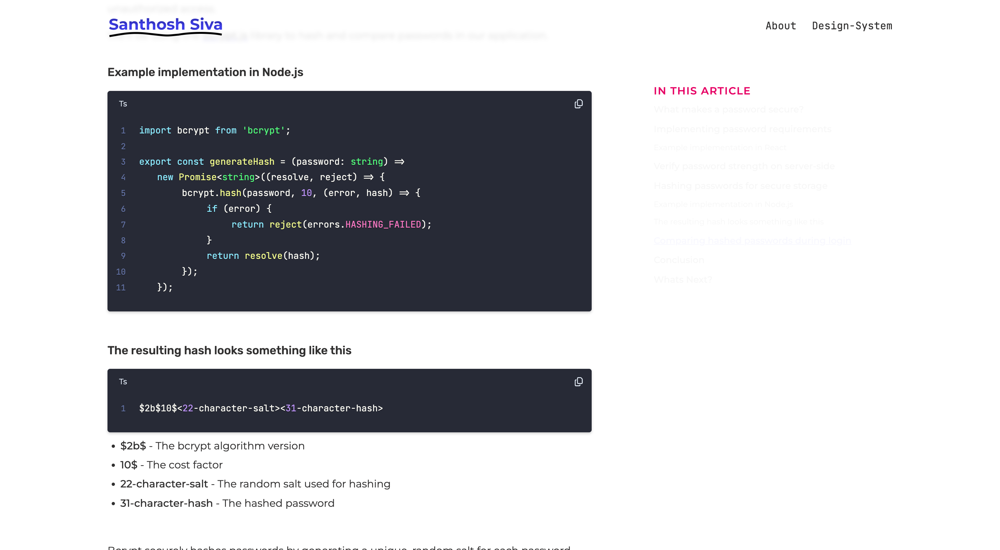

# BlogKit

A reusable, feature-rich blog component library for React and Next.js applications. Built with TypeScript and SCSS modules, BlogKit provides everything you need to create beautiful, interactive blog posts with code highlighting, diagrams, callouts, and more.

## Showcase

See BlogKit in action on [santhoshsiva.dev](https://santhoshsiva.dev):

### Blog Post with Table of Contents


### Rich Content Components


## Features

- **Blog Layout with TOC**: Responsive blog layout with sticky table of contents sidebar
- **Code Highlighting**: Syntax highlighting for multiple programming languages using Prism.js
- **Mermaid Diagrams**: Render flowcharts, sequence diagrams, timelines, and more
- **Callouts**: Info, warning, error, and success notification boxes
- **Data Tables**: Flexible table component with dynamic column sizing
- **Blog Sections**: Hierarchical section organization with auto-generated IDs
- **Blog Links**: Animated link cards for blog navigation
- **TypeScript Support**: Fully typed components with ReactNode support
- **SCSS Modules**: Scoped, customizable styles using stylekit
- **Next.js Optimized**: Works seamlessly with Next.js 14, 15, and 16
- **React 19 Ready**: Full support for React 18 and 19

## Installation

```bash
npm install blogkit
# or
yarn add blogkit
# or
pnpm add blogkit
```

### Peer Dependencies

Make sure you have the following peer dependencies installed:

```bash
npm install react react-dom next
```

## Components

### Blog

Main wrapper component that provides the blog layout with table of contents.

```tsx
import { Blog } from 'blogkit';

function BlogPost() {
  return (
    <Blog title="In this article">
      {/* Your blog content */}
    </Blog>
  );
}
```

**Props:**
- `children`: ReactNode - Blog content
- `title`: string (optional) - TOC header title (default: "In this article")

### BlogHeader

Renders the blog post title and metadata.

```tsx
import { BlogHeader } from 'blogkit';

<BlogHeader
  title={['My Awesome Blog Post', 'A Deep Dive into React']}
  desc={['Published on December 8, 2025', 'By Santhosh Siva']}
  isDescCite={true}
/>
```

**Props:**
- `title`: string[] - Title lines (supports multi-line)
- `desc`: string[] - Description/metadata lines
- `isDescCite`: boolean (optional) - Render description as `<cite>` tag (default: true)

### BlogSection

Hierarchical section component with auto-generated IDs for TOC.

```tsx
import { BlogSection } from 'blogkit';

<BlogSection title="Introduction" category="Getting Started">
  <p>Your content here...</p>

  <BlogSection title="Prerequisites">
    <p>Nested subsections are supported!</p>
  </BlogSection>
</BlogSection>
```

**Props:**
- `title`: string (optional) - Section title
- `category`: string (optional) - Category prefix for the title
- `children`: ReactNode (optional) - Section content
- `increaseMarginBottom`: boolean (optional) - Add extra bottom margin

### CodeBlock

Syntax-highlighted code block with copy functionality.

```tsx
import { CodeBlock } from 'blogkit';

const code = `function hello() {
  console.log('Hello, World!');
}`;

<CodeBlock
  language="javascript"
  code={code}
  hasMarginUp={false}
  hasMarginDown={true}
/>
```

**Props:**
- `language`: string (optional) - Programming language (default: "javascript")
- `code`: string (optional) - Code to display
- `hasMarginUp`: boolean (optional) - Add top margin
- `hasMarginDown`: boolean (optional) - Add bottom margin

**Supported Languages:** javascript, typescript, python, java, go, rust, css, html, json, yaml, bash, and many more via Prism.js

### Callout

Colored notification boxes for highlighting important information.

```tsx
import { Callout } from 'blogkit';

<Callout type="info">
  <p>This is an informational callout.</p>
</Callout>

<Callout type="warning">
  <p>Be careful with this operation!</p>
</Callout>

<Callout type="error">
  <p>An error occurred.</p>
</Callout>

<Callout type="success">
  <p>Operation completed successfully!</p>
</Callout>
```

**Props:**
- `type`: 'info' | 'warning' | 'error' | 'success' - Callout style
- `children`: ReactNode (optional) - Callout content
- `hasMarginUp`: boolean (optional) - Add top margin
- `hasMarginDown`: boolean (optional) - Add bottom margin

### Mermaid

Render Mermaid diagrams (flowcharts, sequence diagrams, etc.).

```tsx
import { Mermaid } from 'blogkit';

const diagram = `
graph TD
  A[Start] --> B[Process]
  B --> C[End]
`;

<Mermaid
  code={diagram}
  id="my-flowchart"
  hasMarginUp={false}
  hasMarginDown={true}
/>
```

**Props:**
- `code`: string - Mermaid diagram code
- `id`: string - Unique identifier for the diagram
- `hasMarginUp`: boolean (optional) - Add top margin
- `hasMarginDown`: boolean (optional) - Add bottom margin

### Table

Flexible data table component with dynamic column sizing.

```tsx
import { Table } from 'blogkit';

<Table
  headers={['Method', 'Description', 'Returns']}
  rows={[
    ['GET', 'Retrieves data', 'Response object'],
    ['POST', 'Creates data', 'Created object'],
    ['PUT', 'Updates data', 'Updated object'],
  ]}
  hasMarginUp={false}
  hasMarginDown={true}
/>
```

**Props:**
- `headers`: ReactNode[] (optional) - Table header cells
- `rows`: ReactNode[][] (optional) - Table data rows
- `hasMarginUp`: boolean (optional) - Add top margin
- `hasMarginDown`: boolean (optional) - Add bottom margin

**Note:** Columns automatically size based on content length. Supports ReactNode for rich content in cells.

### BlogLink

Animated link card component for blog navigation.

```tsx
import { BlogLink } from 'blogkit';

<BlogLink
  title="Getting Started with React"
  desc="Learn the fundamentals of React development"
  isInProgress={false}
/>
```

**Props:**
- `title`: string - Link title
- `desc`: string (optional) - Link description
- `isInProgress`: boolean (optional) - Hide link if true (for draft posts)

## Utilities

### generateIdForBlogTitle

Converts a blog title to a URL-safe ID.

```tsx
import { generateIdForBlogTitle } from 'blogkit';

const id = generateIdForBlogTitle('My Blog Post!');
// Result: 'my-blog-post-'
```

### generateUrlForBlogTitle

Converts a blog title to a URL-encoded slug.

```tsx
import { generateUrlForBlogTitle } from 'blogkit';

const url = generateUrlForBlogTitle('My Blog Post!');
// Result: 'my-blog-post-'
```

## Full Example

```tsx
'use client';

import {
  Blog,
  BlogHeader,
  BlogSection,
  CodeBlock,
  Callout,
  Mermaid,
  Table,
} from 'blogkit';

const code = `function fibonacci(n) {
  if (n <= 1) return n;
  return fibonacci(n - 1) + fibonacci(n - 2);
}`;

const diagram = `
graph LR
  A[Input] --> B[Process]
  B --> C[Output]
`;

export default function MyBlogPost() {
  return (
    <Blog title="Table of Contents">
      <BlogHeader
        title={['Understanding Recursion', 'in JavaScript']}
        desc={['Published on December 8, 2025']}
      />

      <BlogSection title="Introduction">
        <p>
          Recursion is a powerful programming technique where a function calls itself.
        </p>

        <Callout type="info" hasMarginDown>
          <p>This guide assumes basic JavaScript knowledge.</p>
        </Callout>
      </BlogSection>

      <BlogSection title="Example Implementation">
        <p>Here's a classic example of recursion:</p>

        <CodeBlock
          language="javascript"
          code={code}
          hasMarginDown
        />
      </BlogSection>

      <BlogSection title="Visualization">
        <p>Here's how the recursive calls flow:</p>

        <Mermaid
          code={diagram}
          id="recursion-flow"
          hasMarginDown
        />
      </BlogSection>

      <BlogSection title="Performance Comparison">
        <p>Comparing recursive vs iterative approaches:</p>

        <Table
          headers={['Approach', 'Time Complexity', 'Space Complexity']}
          rows={[
            ['Recursive', 'O(2^n)', 'O(n)'],
            ['Iterative', 'O(n)', 'O(1)'],
            ['Memoized', 'O(n)', 'O(n)'],
          ]}
          hasMarginDown
        />
      </BlogSection>

      <BlogSection title="Conclusion">
        <p>Recursion is elegant but watch out for stack overflow!</p>

        <Callout type="warning">
          <p>Always ensure your recursive function has a base case.</p>
        </Callout>
      </BlogSection>
    </Blog>
  );
}
```

## Customization

### Styling

BlogKit uses SCSS modules for styling. You can customize the appearance by overriding CSS variables or creating your own theme:

```scss
// In your global CSS/SCSS file
:root {
  --blogkit-primary-color: #4242fa;
  --blogkit-font-family: 'Your Font', sans-serif;
}
```

### Variables

Key SCSS variables that can be customized (defined in `src/styles/_variables.scss`):

- `$color--primary`: Primary accent color
- `$color--secondary`: Secondary color
- `$color--error`: Error color
- `$font-family--primary`: Primary font family
- `$font-family--code`: Code font family
- `$border-radius`: Border radius for components

## Browser Support

- Chrome (latest)
- Firefox (latest)
- Safari (latest)
- Edge (latest)

## Contributing

Contributions are welcome! This package is extracted from a personal blog project and can be enhanced with:

- MDX/Markdown support
- More theme customization options
- Additional callout types
- More diagram types
- Accessibility improvements

## License

MIT

## Author

Santhosh Siva

## Changelog

### 1.0.0 (2025-12-08)

- Initial release
- Core blog components
- Code highlighting with Prism.js
- Mermaid diagram support
- Callout components
- TypeScript support
- SCSS modules
