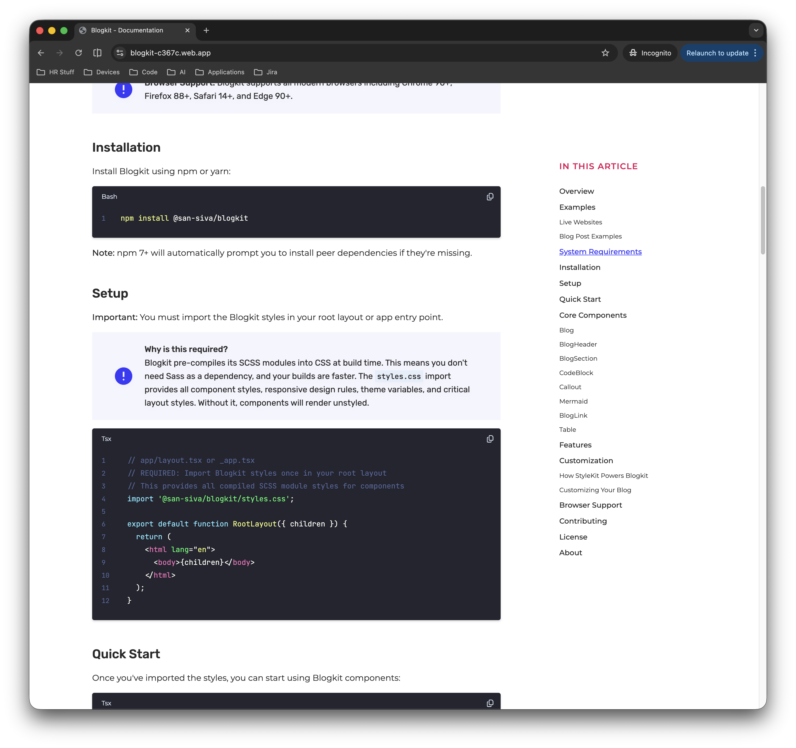

# Blogkit



A comprehensive, production-ready blog component library for React and Next.js applications. Built with TypeScript and SCSS modules, Blogkit provides a complete suite of components for creating professional, interactive blog posts with advanced features including syntax highlighting, diagram rendering, callouts, and more.

**[View Full Documentation](https://blogkit-c367c.web.app/)**

## Overview

Blogkit is designed to streamline the development of content-rich blog applications by providing a modular, customizable component library. It supports modern React patterns, offers full TypeScript support, and includes responsive design out of the box.

## Features

- **Blog Layout System**: Pre-built layout components with table of contents navigation
- **Syntax Highlighting**: Code block components with multi-language support via Prism.js
- **Diagram Rendering**: Integrated Mermaid.js support for flowcharts, sequence diagrams, and more
- **Content Components**: Callouts, data tables, and specialized blog link components
- **TypeScript Support**: Fully typed API for enhanced developer experience
- **Responsive Design**: Mobile-first design with SCSS modules
- **React 19 Compatible**: Built to work seamlessly with the latest React version
- **Next.js Optimized**: Designed for optimal performance in Next.js applications

## Installation

```bash
npm install @san-siva/blogkit
# or
yarn add @san-siva/blogkit
# or
pnpm add @san-siva/blogkit
```

> **Note:** The required `@san-siva/stylekit` package is automatically installed as a dependency.

### Peer Dependencies

npm 7+ will automatically prompt you to install peer dependencies. If you need to install them manually:

```bash
npm install @react-spring/web mermaid prismjs react-syntax-highlighter
```

**Note:** Blogkit also requires `react@^19.0.0`, `react-dom@^19.0.0`, and `next@^16.0.10`, which are typically already installed in Next.js projects.

## Quick Start

### 1. Import Styles

First, import the required stylesheets in your root layout or app entry point:

```tsx
// app/layout.tsx or _app.tsx
import '@san-siva/blogkit/styles.css';
```

**Why is this required?**

Blogkit pre-compiles its SCSS modules into CSS at build time. This approach provides several benefits:
- **No Sass dependency** - You don't need to install Sass in your project
- **Faster builds** - CSS is already compiled, no SCSS processing needed
- **Better compatibility** - Avoids conflicts with different Sass versions

The `styles.css` import provides:
- All component styles (Blog, CodeBlock, Mermaid, Table, Callout, etc.)
- Responsive design rules
- Theme variables and custom properties
- Critical layout styles

Without this import, components will render unstyled.

### 2. Use Components

```tsx
import { Blog, BlogHeader, BlogSection, CodeBlock, Callout } from '@san-siva/blogkit';

export default function MyBlogPost() {
	return (
		<Blog>
			<BlogHeader
				title={['My First Blog Post']}
				desc={['Published on December 15, 2025']}
			/>

			<BlogSection title="Introduction">
				<p>Welcome to my blog built with Blogkit!</p>

				<Callout type="info" hasMarginDown>
					<p>This is an informational callout.</p>
				</Callout>

				<CodeBlock
					language="typescript"
					code={`const greeting = "Hello, Blogkit!";`}
					hasMarginDown
				/>
			</BlogSection>
		</Blog>
	);
}
```

## Documentation

Comprehensive documentation is available at [https://blogkit-c367c.web.app/](https://blogkit-c367c.web.app/)

The documentation includes:

- Complete component API reference
- Interactive live examples
- Implementation guides and best practices
- Code snippets for all components
- Customization and theming guide
- TypeScript usage examples and type definitions

## Examples

See Blogkit in action in these blogs and documentation sites:

- **[Gitsy](https://gitsy-56895.web.app/)** - A blog built with Blogkit showcasing various components
- **[Optimizing Background Tasks with requestIdleCallback](https://santhoshsiva.dev/blog/optimizing-background-tasks-with-requestidlecallback-advanced-scheduling-in-the-javascript-event-loop/)** - Advanced scheduling in the JavaScript event loop
- **[Linting at Scale](https://santhoshsiva.dev/blog/linting-at-scale-strategies-for-updating-eslint-configs-in-large-applications/)** - Strategies for updating ESLint configs in large applications

## System Requirements

### Development Environment

- **Node.js**: 18.0.0 or higher (20.x LTS recommended)
- **Package Manager**: npm 7+, yarn 1.22+, or pnpm 8+
- **TypeScript**: 5.0.0 or higher (optional, but recommended for type safety)

### Runtime Dependencies

- **React**: ^19.0.0 or higher
- **React DOM**: ^19.0.0 or higher
- **Next.js**: ^16.0.10 or higher

### Operating System

Blogkit is cross-platform and supports:
- **macOS**: 10.15 (Catalina) or later
- **Windows**: 10 or later
- **Linux**: Most modern distributions (Ubuntu 20.04+, Debian 10+, etc.)

### Browser Support

Blogkit supports all modern browsers:
- **Chrome**: Latest version
- **Firefox**: Latest version
- **Safari**: Latest version (macOS and iOS)
- **Edge**: Latest version

Minimum browser versions:
- Chrome 90+
- Firefox 88+
- Safari 14+
- Edge 90+

## Contributing

Contributions are welcome and appreciated. To contribute:

1. Fork the repository
2. Create a feature branch (`git checkout -b feature/improvement`)
3. Commit your changes (`git commit -am 'Add new feature'`)
4. Push to the branch (`git push origin feature/improvement`)
5. Open a Pull Request

Please ensure your code follows the existing style conventions and includes appropriate tests.

For bug reports and feature requests, please [open an issue](https://github.com/san-siva/blogkit/issues) on GitHub.

## License

MIT © [Santhosh Siva](https://santhoshsiva.dev)

## Author

**Santhosh Siva**
- Website: [https://santhoshsiva.dev](https://santhoshsiva.dev)
- GitHub: [@san-siva](https://github.com/san-siva)
